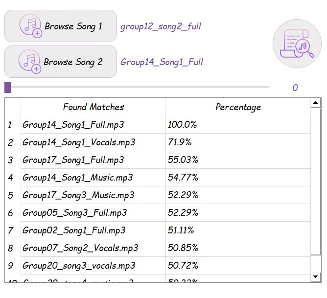
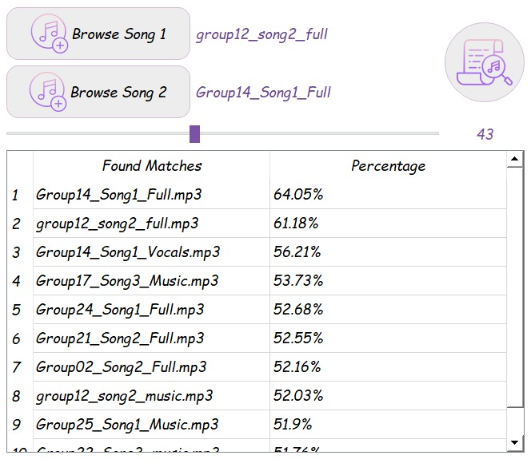

# Shazam-Like-App
 Fingerprinting is basically to identify a signal based on a short sample for it which usually has its intrinsic features and thus these intrinsic features can be used to identify the different varieties or flavors of the signal. Several applications can be directly spotted for such technique. For example:
 * Music industry: Identify a song, a singer voice, a tune.
 * Medical diagnosis: identify arrhythmia types in ECG signals.

---

## *About the app:*
This application used to recognize songs, lyrics, and music using a *database* which contains the components of each song (MFCC component, Melspectrogram component, Chroma Stft component) in a spectrogram form.

- Pick either one song, or two songs and mix between them (The slider percentage applies to the first song while the second songs take 100-Percentage)
- Best matcjes of selected files would appear in the table arranged descendingly. 
***
## *In order to make your own CSV Database*:
- Add the songs you want in the folder ' CreateDB ' and run the file  "CreateDateBase.py"
***
### Mixing 100% of second song with none of the first.

### Mixing two songs with ratio 43% of the first song with 57% of the second.

***

It was a team project done by:

[Marwa Abdelaal](https://github.com/MarwaAbdelAal), 
[Meirna Kamal](https://github.com/Meirna-kamal), 
[Nada Ezzat](https://github.com/nadaezzat-99), 
[Noura Mahmoud](https://github.com/Noura-Mahmoud)

